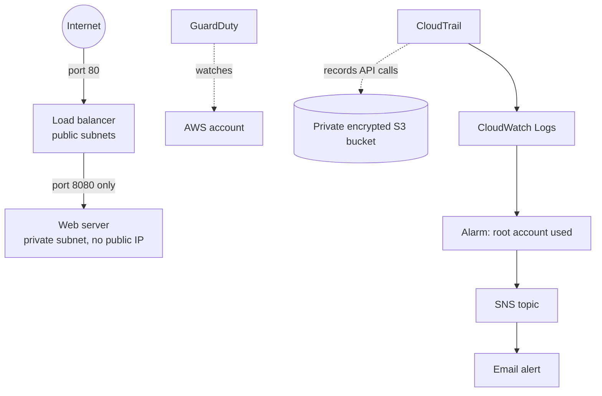
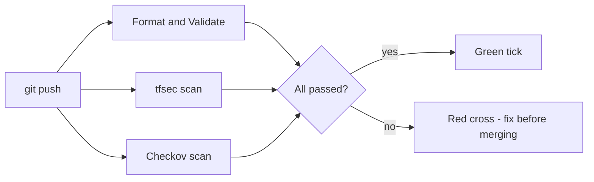

# SecureStack

By Richard Lamy

A small AWS project built with Terraform, plus a GitHub Actions pipeline that **automatically scans every change for security mistakes**. If the scan finds a problem, the pipeline goes red.

## Why I built this

I'm a second-year cybersecurity apprentice, mostly focused on penetration testing and risk assessment. I wanted a project that also shows the DevOps side: infrastructure as code, a CI/CD pipeline, and thinking about cloud security from the "building it safely" side instead of only the "attacking it" side. It is a learning project, not production software, and I kept it small so I can explain every part of it.

## Aim and research questions

**Aim:** design, build and evaluate an automated security pipeline for AWS infrastructure defined as code, and measure how well it prevents and detects misconfigurations.

1. **RQ1:** How much does a security-hardened design reduce the number of scanner findings compared with a deliberately insecure baseline?
2. **RQ2:** What proportion of deliberately introduced security mistakes do automated scanners (tfsec and Checkov) detect, and which kinds do they miss?
3. **RQ3:** Do the controls hold up when the deployed system is tested from the outside?

## What it builds



- **Network:** a VPC with public and private subnets. Only the load balancer is public.
- **Web server:** one small EC2 server in a private subnet showing a simple web page. No public IP, no SSH, no IAM role (it doesn't need one).
- **Firewalls:** each layer only accepts traffic from the layer in front of it.
- **Monitoring:** GuardDuty (threat detection), CloudTrail (audit log of every API call), VPC flow logs, and an alarm that emails me if the AWS root account is ever used.

## The pipeline



It runs on every push. It only reads the code, so **it needs no AWS account and no secrets**.

## Project layout

| Path | What it is |
|---|---|
| `terraform/network.tf` | VPC, subnets, route tables, flow logs |
| `terraform/security_groups.tf` | The firewall rules |
| `terraform/alb.tf` | The load balancer |
| `terraform/compute.tf` | The web server |
| `terraform/app/user_data.sh` | Script that creates the web page when the server boots |
| `terraform/iam.tf` | Permissions (least privilege) |
| `terraform/monitoring.tf` | GuardDuty, CloudTrail, the alarm |
| `terraform/variables.tf`, `outputs.tf` | Settings in, useful values out |
| `.github/workflows/security-checks.yml` | The pipeline |
| `baseline-insecure/` | A deliberately insecure "before" version. **Never deployed**, only scanned |
| `tests/` | Scripts for Experiments 1 and 2 |
| `docs/threat-model.md` | STRIDE, MITRE ATT&CK mapping, risk register, NIST CSF and CIS mapping |
| `docs/runtime-test-plan.md` | Experiment 3: tests to run against the deployed system |
| `docs/results/` | Saved output from the experiments |

---

## Evaluation

| Experiment | Question | Headline result | Details |
|---|---|---|---|
| 1. Baseline vs hardened scans | RQ1 | tfsec findings fell from 23 to 10, and Checkov failed checks from 37 to 19, with every exception removed so nothing is hidden. The remaining findings are the risks I chose to accept and documented | [`scan-comparison.md`](docs/results/scan-comparison.md) |
| 2. Negative testing (16 deliberate mistakes) | RQ2 | tfsec caught 12 of 16, Checkov 14 of 16, together 14 of 16. Both missed deleting the alarm and moving the server to a public subnet | [`negative-test-results.md`](docs/results/negative-test-results.md) |
| 3. Runtime testing of the deployed system | RQ3 | Test plan written. Results to be added after deployment | [`runtime-test-plan.md`](docs/runtime-test-plan.md) |

The main finding from Experiment 2 is that code scanners check whether the resources that exist are configured safely, but they can't tell whether the right resources exist or are in the right place. That is why the design also includes runtime detection and why Experiment 3 tests the real deployment.

The risk analysis is in [`docs/threat-model.md`](docs/threat-model.md). The highest remaining risk is stolen operator credentials, which can't be fixed by the Terraform code itself.

### Reproducing Experiments 1 and 2

You need Python 3.9+, [Checkov](https://www.checkov.io/) and tfsec.

```bash
pip install checkov
```

Download tfsec from the [tfsec releases page](https://github.com/aquasecurity/tfsec/releases) (on Windows get `tfsec-windows-amd64.exe`, rename it `tfsec.exe`, and put it in the project folder). Then, from the project folder:

```bash
python tests/compare_scans.py      # Experiment 1 (about 1 minute)
python tests/negative_tests.py     # Experiment 2 (about 1 to 2 minutes)
```

Each script prints its results and saves a Markdown report in `docs/results/`. Exact numbers can change if the scanners' rules are updated, so the versions used are recorded in the reports.

---

## Try it yourself

### Part 1: Watch the pipeline run (about 5 minutes, free, no AWS needed)

1. Create a new empty repo on GitHub called `securestack`.
2. In the project folder run:
   ```bash
   git init
   git add .
   git commit -m "Initial commit"
   git branch -M main
   git remote add origin https://github.com/YOUR-USERNAME/securestack.git
   git push -u origin main
   ```
3. Open the repo on GitHub, click the **Actions** tab, and open the latest run.
4. After a minute or two you should see three green ticks: **Format and Validate**, **tfsec scan**, **Checkov scan**.

### Part 2: Break it on purpose (the best part to show someone)

This proves the pipeline really blocks insecure code.

1. Create a branch:
   ```bash
   git checkout -b test-insecure-change
   ```
2. Paste this at the bottom of `terraform/security_groups.tf`. It opens SSH (port 22) to the whole internet, a classic mistake:
   ```hcl
   resource "aws_security_group_rule" "oops_ssh" {
     type              = "ingress"
     security_group_id = aws_security_group.app.id
     description       = "TEST ONLY - SSH from anywhere"
     from_port         = 22
     to_port           = 22
     protocol          = "tcp"
     cidr_blocks       = ["0.0.0.0/0"]
   }
   ```
3. Commit and push:
   ```bash
   git add .
   git commit -m "Test: open SSH to the world"
   git push -u origin test-insecure-change
   ```
4. Check the **Actions** tab. **tfsec scan** and **Checkov scan** should go red. Click into them to see the finding (tfsec reports it as CRITICAL, Checkov as `CKV_AWS_24`).
5. Take a screenshot, then undo it:
   ```bash
   git checkout main
   ```
   (Or delete the branch on GitHub.)

### Part 3 (optional): Deploy it for real

This creates real resources in AWS. It costs pennies for an hour-long demo, but the load balancer keeps charging while it exists, so **run Part 4 when you're done**.

**You need:** an AWS account, [Terraform](https://developer.hashicorp.com/terraform/install), and the [AWS CLI](https://aws.amazon.com/cli/).

1. **Don't use the root account.** Create an IAM user for practice (the easiest option in a personal practice account is to give it `AdministratorAccess`), make an access key, then run:
   ```bash
   aws configure
   ```
   Delete the access key when you're finished. (If you use root, you will trigger the alarm this project builds!)
2. Set your email so the alarm can reach you:
   ```bash
   cd terraform
   copy example.tfvars terraform.tfvars      # Mac/Linux: cp example.tfvars terraform.tfvars
   ```
   Open `terraform.tfvars` and change the email to your real one. This file is gitignored, so it never goes on GitHub.
3. Build it:
   ```bash
   terraform init
   terraform plan
   terraform apply
   ```
   Read the plan, then type `yes`. It takes a few minutes.
4. Open the `website_url` that Terraform prints. If you see a 502/503 error, wait 2-3 minutes for the server to boot and pass its health check, then refresh.
5. Check your inbox for an email from AWS Notifications and click **Confirm subscription**, otherwise the alarm can't email you.
6. Look around the AWS console (VPC, EC2, GuardDuty, CloudTrail) and take screenshots. The web server's page is only reachable through the load balancer, which is the whole point.

### Part 4: Clean up

```bash
cd terraform
terraform destroy
```
Type `yes`. This removes everything so nothing keeps costing money.

---

## Things the scanners flagged that I chose to accept

The scanners aren't always "fix everything". Some findings are trade-offs. Each one below is marked in the code with a comment explaining why. For a real production system I'd revisit all of them.

| What was flagged | Why I accepted it for this demo | What I'd do in production |
|---|---|---|
| Load balancer uses HTTP, not HTTPS | HTTPS needs a domain name and certificate | Add a domain, an ACM certificate, and redirect HTTP to HTTPS |
| Load balancer and port 80 open to the internet | It is a public website, so this is intentional | Same, plus a WAF in front |
| No load balancer access logs, deletion protection or WAF | Extra cost and I want `terraform destroy` to work | Turn all three on |
| Logs, S3 bucket and CloudTrail use AWS default encryption, not a custom KMS key | Custom keys need careful key policies | Use customer-managed KMS keys |
| No access logging, replication or notifications on the log bucket | Overkill for a demo | Add them |
| SNS alert topic not encrypted | CloudWatch alarms can't publish to a topic using the default AWS key | Use a customer-managed key with the right policy |
| Web server has no IAM role | It doesn't call any AWS service, so it needs no permissions | Add a narrowly scoped role only if the app needs one |
| GuardDuty organisation check | I only have one account | Use organisation-wide GuardDuty |
| Wildcard `:*` in the flow logs IAM policy | It only covers log streams inside one named log group | Same |

## Troubleshooting

| Problem | Fix |
|---|---|
| `No valid credential sources found` | Run `aws configure` |
| Terraform asks for `alert_email` | Create `terraform.tfvars` (Part 3, step 2) |
| Website shows 502/503 | Wait 2-3 minutes after `apply` and refresh |
| `detector already exists` (GuardDuty) | GuardDuty was already switched on in this account. Disable it in the console, or run `terraform import aws_guardduty_detector.main <existing-detector-id>` |
| No matching availability zones | The code uses zones `a` and `b` in your region. Pick a region that has them (e.g. `eu-west-2`) |
| Pipeline fails on `terraform fmt` | Run `terraform fmt -recursive` and push again |

## Key ideas this project shows

- **Infrastructure as code:** the whole environment is described in files, so it can be reviewed, repeated and destroyed.
- **Least privilege:** every permission is scoped to exactly what it needs, and the web server has none.
- **Defence in depth:** private subnet, tight firewall rules, no SSH, encrypted disk, IMDSv2, then monitoring on top.
- **Shift left:** security checks run automatically on every push, before anything gets deployed.
- **Detection and response basics:** GuardDuty, CloudTrail and an alarm for the highest-risk event (root account use).

## What I'd add next

- HTTPS with a real domain and certificate
- A database in a private subnet, with its password in AWS Secrets Manager
- Automatic deployment from the pipeline using GitHub OIDC (no stored AWS keys)
- A remote Terraform state in S3 with locking

## Built with

Terraform · AWS (VPC, ALB, EC2, IAM, GuardDuty, CloudTrail, CloudWatch, SNS, S3) · GitHub Actions · tfsec · Checkov
