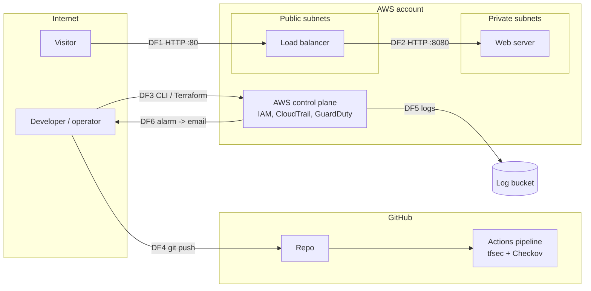

# Threat model and risk assessment

Author: Richard Lamy

This document analyses the security of SecureStack using STRIDE, maps threats to MITRE ATT&CK (Cloud), scores them in a risk register, and relates the controls to NIST CSF 2.0 and the CIS AWS Foundations Benchmark.

> **Status of the scores:** the likelihood and impact ratings below are my own judgement as a first draft. They should be reviewed, and any rating I can't justify in the report should be changed. Having a second person rate the risks independently would reduce bias.

## 1. Scope and assumptions

**In scope:** the AWS environment defined in `terraform/` (VPC, load balancer, EC2 server, IAM roles, S3 log bucket, CloudTrail, GuardDuty, CloudWatch, SNS) and the GitHub Actions pipeline.

**Out of scope:** application code (the page is static), AWS's own infrastructure (the shared responsibility model puts that on AWS), physical security, and end-user devices.

**Assumptions:**
- One AWS account, one operator (me), and an environment that exists for hours, not months.
- No real user data or personal data is processed.
- Terraform state is stored locally.

## 2. Assets

| ID | Asset | Why it matters |
|---|---|---|
| A1 | The web service | Availability and integrity of what visitors see |
| A2 | AWS account and operator credentials | Compromise gives control of everything else |
| A3 | Audit logs (CloudTrail bucket) | Evidence for detecting and investigating incidents |
| A4 | Terraform code, state and the GitHub repo | Changing these changes what gets deployed |
| A5 | The EC2 server and its metadata service | A foothold inside the VPC if compromised |

## 3. Trust boundaries and data flows

## 4. STRIDE analysis

| Element / flow | STRIDE | Threat | Existing control | Gap or residual risk |
|---|---|---|---|---|
| Load balancer (DF1) | T, I | Traffic is plain HTTP, so an on-path attacker could read or alter it | None (accepted) | No HTTPS. Needs a domain and certificate |
| Load balancer (DF1) | D | Flooding the public endpoint | AWS Shield Standard applies automatically to AWS resources | No WAF, rate limiting or multi-instance redundancy |
| Web server | E | SSRF used to steal credentials from the instance metadata service | IMDSv2 enforced, and the server has no IAM role so there are no credentials to steal | Low |
| Web server | S, T | Direct connection from the internet | Private subnet, no public IP, security group only trusts the load balancer, no SSH | Low |
| Web server | I | Disk removed or snapshotted and read | EBS encryption enabled | Uses the AWS-managed key, not a customer-managed key |
| IAM roles | E | A role with excessive permissions is abused | Each role is limited to writing to one log group | Reviewed by scanners, but not formally verified (e.g. IAM Access Analyzer not used) |
| CloudTrail and log bucket | R, T | An attacker deletes or alters logs to hide their actions | Log file validation, versioning, public access blocked, TLS-only bucket policy | No S3 Object Lock or MFA delete, and no customer-managed KMS key |
| Operator credentials (DF3) | S, E | Stolen or leaked access keys | Alarm on root account use | MFA/SSO is not enforced by this code. Long-lived access keys are a risk |
| CI pipeline (DF4) | T | A malicious or compromised third-party GitHub Action alters the build | Workflow permissions limited to `contents: read`, no secrets in the pipeline | Actions are pinned to version tags, not commit hashes |
| Terraform state | I | State file read by someone with access to the laptop | No secrets are stored in this version | Local, unencrypted state. A remote encrypted backend would be better |
| Detection (DF5, DF6) | R | An intrusion goes unnoticed | GuardDuty, CloudTrail, VPC flow logs, root-usage alarm | Alarm only covers root usage. GuardDuty findings are not forwarded to email |
| Response | n/a | Slow or no reaction to an alert | Email notification | No incident response runbook |

## 5. MITRE ATT&CK (Cloud) mapping

Technique names and IDs should be checked against [attack.mitre.org](https://attack.mitre.org/) when writing up, because the matrix is updated regularly.

| Technique | How it could apply here | Control | Residual |
|---|---|---|---|
| T1190 Exploit Public-Facing Application | Attacking the load balancer or the web page | Only the load balancer is public and only one port is open. The app is a static page | Low for this app. Would be higher for a real application |
| T1078.004 Valid Accounts: Cloud Accounts | Using stolen AWS keys | Root-usage alarm, CloudTrail records activity | MFA and short-lived credentials are not enforced |
| T1552.005 Unsecured Credentials: Cloud Instance Metadata API | SSRF to the metadata service | IMDSv2 required, no instance role | Low |
| T1562.008 Impair Defenses: Disable or Modify Cloud Logs | Switching off or editing CloudTrail | Log file validation, multi-region trail, versioned bucket | An attacker with enough IAM rights could still stop the trail. The scanners do not detect deletion of the alarm (Experiment 2, M15) |
| T1530 Data from Cloud Storage | Reading the log bucket | Public access block, TLS-only policy, no public ACLs | Low |
| T1580 Cloud Infrastructure Discovery | Enumerating resources after gaining access | Least-privilege roles, GuardDuty | Medium. Depends on the credentials obtained |

## 6. Risk register

**Method:** Likelihood (1 to 5) multiplied by Impact (1 to 5). Bands: 1-4 Low, 5-9 Medium, 10-14 High, 15-25 Critical. "Inherent" means before the controls in this project. "Residual" means after.

| ID | Risk | Inherent L x I | Inherent | Controls | Residual L x I | Residual |
|---|---|---|---|---|---|---|
| R1 | Server exposed to the internet through a misconfiguration (e.g. open SSH) | 4 x 4 | 16 Critical | Private subnet, security-group-to-security-group rules, no SSH, pipeline scan | 1 x 4 | 4 Low |
| R2 | SSRF leads to credential theft from instance metadata | 3 x 5 | 15 Critical | IMDSv2, no instance role | 1 x 2 | 2 Low |
| R3 | Over-permissive IAM role abused | 4 x 5 | 20 Critical | Least-privilege policies, scanner checks for wildcards | 2 x 4 | 8 Medium |
| R4 | Plain HTTP traffic intercepted or altered | 3 x 2 | 6 Medium | None (accepted) | 3 x 2 | 6 Medium |
| R5 | Audit logs deleted or tampered with | 3 x 4 | 12 High | Log validation, versioning, blocked public access | 2 x 3 | 6 Medium |
| R6 | Operator credentials stolen | 3 x 5 | 15 Critical | Root-usage alarm only | 3 x 4 | 12 High |
| R7 | Insecure change reaches AWS | 4 x 4 | 16 Critical | Pipeline gate, deployment is manual | 2 x 4 | 8 Medium |
| R8 | Scanner blind spot (missing control or wrong placement) | 3 x 4 | 12 High | Code review, runtime tests, GuardDuty | 2 x 3 | 6 Medium |
| R9 | Intrusion goes unnoticed | 3 x 4 | 12 High | GuardDuty, CloudTrail, flow logs, root alarm | 2 x 4 | 8 Medium |
| R10 | Web service made unavailable | 3 x 2 | 6 Medium | Shield Standard (automatic) | 3 x 2 | 6 Medium |
| R11 | Compromised third-party GitHub Action | 2 x 4 | 8 Medium | Read-only workflow permissions, no secrets in the pipeline | 2 x 3 | 6 Medium |

**Highest remaining risk: R6 (stolen operator credentials).** It is outside what the Terraform code can fix. The mitigation is operational: MFA or SSO, no long-lived access keys, and GitHub OIDC for automation.

**Accepted risks:** R4 and R10 are accepted for a short-lived demo with no real data. They would not be acceptable for a real service.

## 7. NIST CSF 2.0 mapping

| Function | What this project does | Gap |
|---|---|---|
| Govern | Documented accepted risks and a risk register | No formal policy or roles |
| Identify | Everything is declared in code, tagged, and has an asset list above | No automated inventory |
| Protect | Network segmentation, least-privilege IAM, encryption, IMDSv2, pipeline scanning | HTTPS, MFA and customer-managed keys missing |
| Detect | GuardDuty, CloudTrail, flow logs, root-usage alarm | Narrow alerting |
| Respond | Email alert | No runbook or automation |
| Recover | The whole environment can be rebuilt with `terraform apply` | No tested recovery drill. Nothing stateful to back up |

## 8. Alignment with the CIS AWS Foundations Benchmark

This is a manual mapping by topic. When citing it in the report, use the exact version of the benchmark and its section numbers, which change between versions. I have not run a formal CIS audit tool. An open-source tool such as Prowler could do that against the deployed account as an extension.

| Benchmark topic | How it is addressed |
|---|---|
| CloudTrail enabled in all regions | `is_multi_region_trail = true` |
| CloudTrail log file validation | `enable_log_file_validation = true` |
| CloudTrail bucket not publicly accessible | Public access block on the bucket |
| CloudTrail integrated with CloudWatch Logs | Trail sends logs to a log group |
| Alarm for use of the root account | Metric filter plus alarm plus SNS email |
| VPC flow logging enabled | `aws_flow_log` on the VPC |
| Default security group restricts all traffic | `aws_default_security_group` with no rules |
| No unrestricted SSH (0.0.0.0/0 to port 22) | No SSH rule at all, and enforced by the pipeline (Experiment 2, M01) |
| EBS volumes encrypted | `encrypted = true` |
| Instance metadata requires IMDSv2 | `http_tokens = "required"` |
